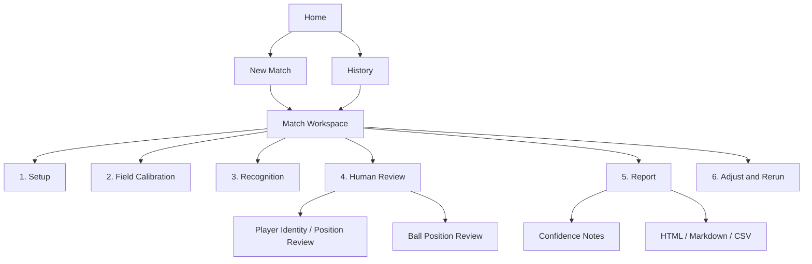
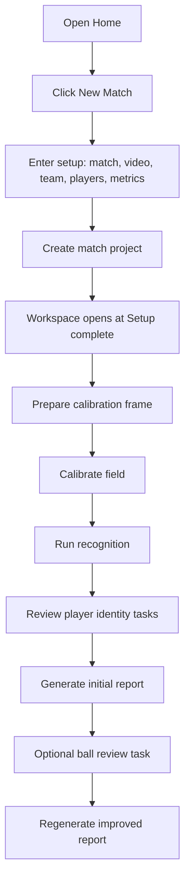
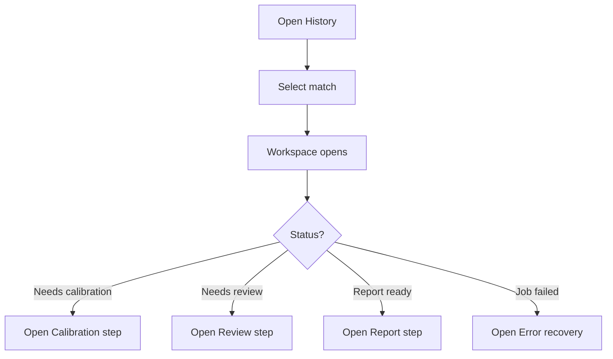
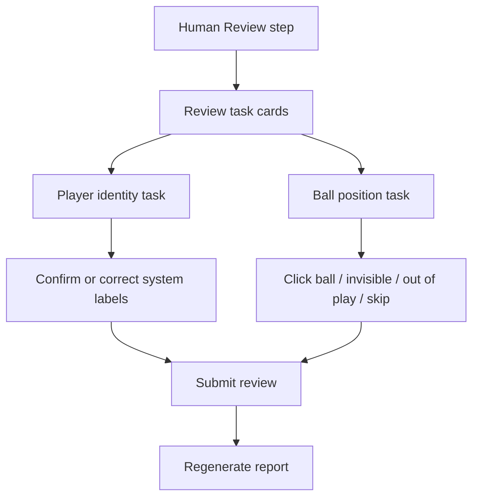
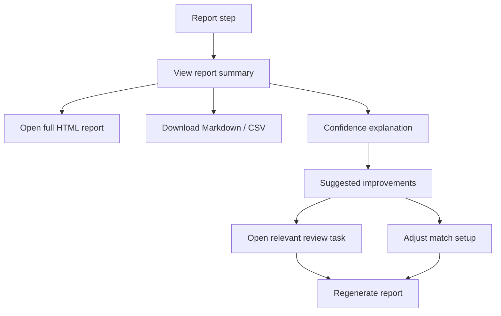

# DESIGN.md

## Purpose

This document is the UI and UX source of truth for the football video analysis workspace. It is written for human designers, product owners, and AI coding agents that will modify the interface later.

The goal is not to make the app look more decorative. The goal is to make the analysis workflow clear, recoverable, and trustworthy from video import to final report.

Reference influence: Google Stitch describes `DESIGN.md` as a design system document that AI agents can read to generate consistent UI across a project. This document follows that spirit: it defines product intent, information architecture, interaction rules, visual language, component behavior, and acceptance criteria.

## Product Definition

The product is a local football match analysis workbench for 5-a-side amateur matches. It helps a user turn one fixed-camera match video into:

- Player ratings.
- Movement and tactical review.
- Key timestamps.
- Low-to-medium confidence technical candidates such as passing, shooting, 1v1, pressure, and space creation.
- Markdown, HTML, and CSV outputs.

The product is not a generic video annotation tool. Manual work exists only to improve report trust. Every manual review screen must explain what it affects and how close the match is to a usable report.

## Primary User

The current primary user is an analyst-coach operating a local command-line-backed web app. They understand football but should not need to understand internal files such as `match.yaml`, `review_manifest.yaml`, or `tracks_red_labeled.csv`.

Key user traits:

- Wants a reliable report more than perfect automation.
- Accepts light manual confirmation when it improves trust.
- Needs to rerun or adjust historical matches.
- Needs clear confidence boundaries, especially for ball-dependent metrics.
- May use the app repeatedly across future matches.

## UX North Star

One match should feel like one project with one visible path:

```text
Create or open match
  -> confirm setup
  -> calibrate field
  -> run recognition
  -> review system uncertainty
  -> generate report
  -> refine and rerun if needed
```

The user should always know:

- Which match is active.
- Which step is current.
- What is done.
- What still needs human action.
- What the next recommended action is.
- Whether report values are formal, candidate, or low-confidence proxy values.

## Current UX Problems To Fix

### 1. Navigation mirrors code modules, not user goals

Current top-level tabs are:

- New match analysis.
- Field calibration and run.
- Manual review.
- History.

This makes four areas appear parallel, but the real flow is sequential. The user does not come to "use a calibration page"; they come to move a match toward a report.

### 2. Current match context is weak

Most screens depend on `currentMatchId`, but the UI does not keep a persistent match context bar. This creates anxiety when moving between history, calibration, review, and reports.

### 3. Status is fragmented

Status appears in multiple places:

- Job panel.
- Form workflow text.
- Calibration status.
- Review status.
- History row status.
- Feedback modal.

These should be unified into a single match progress model.

### 4. History actions are ambiguous

History rows mix safe actions and rerun actions:

- Adjust settings.
- Field calibration.
- Manual review.
- Generate review.

The user cannot easily know which action only views state, which action reruns detection, and which action changes generated outputs.

### 5. Manual review is hidden inside a page, not treated as work

Player identity review and ball review are not just tabs. They are review tasks with progress, confidence impact, and completion requirements.

### 6. Reports are treated as files, not as the destination

After report generation, the user is pushed to history and must open HTML or MD links. The report should be the final step inside the active match workspace.

### 7. Confidence language is not productized

Users ask why indicators remain low or medium confidence. The app should state the reason in product language:

- Ball points are sampled, not continuous.
- Player identity is partly auto-bound.
- Passing and shooting are candidates, not official stats.
- More review can improve certain metrics.

## Target Information Architecture

Replace the four-tab mental model with a project workspace model.



### Top-Level Navigation

The global header should have only two primary destinations:

- `New Match`
- `History`

Once a match is selected or created, the user enters `Match Workspace`.

### Match Workspace

The workspace is the center of the app. It replaces the current scattered tabs.

Persistent elements:

- Match context bar.
- Stepper.
- Current step content.
- Background job status.
- Next recommended action.

Recommended layout:

```text
Header
  App title
  New Match
  History

Match Context Bar
  Match name / team / video / status
  Primary next action
  Secondary actions

Stepper
  Setup -> Calibration -> Recognition -> Human Review -> Report

Main Content
  Active step panel

Right Rail or Top Summary
  Job status
  Review tasks
  Report confidence
```

## Core User Paths

### Path A: New Match To First Report



Design requirements:

- The user never has to think about `match.yaml`.
- After each submit, the UI moves to the next step automatically.
- Each step shows done, active, blocked, or optional.
- The final report appears in the workspace, not only in history.

### Path B: Continue Existing Match



Design requirements:

- History rows should not expose every internal action.
- Row click opens workspace.
- The workspace decides the recommended next action.

### Path C: Human Review



Design requirements:

- Human review should start with task cards, not raw lists.
- Each task shows progress and confidence impact.
- Review screens must support large-image mode.
- Ball review must keep action controls visible in large-image mode.
- Submission must show what happens next.

### Path D: Report Review And Rerun



Design requirements:

- Report page must show whether the report is ready, stale, or generating.
- Report confidence should explain limits without cluttering the report body.
- Rerun should be deliberate and scoped.

## Workspace Step Model

Each step has:

- Name.
- Status.
- Progress.
- Required or optional.
- Primary action.
- Secondary actions.
- Data source.
- Output.

Step statuses:

| Status | Meaning | UI Treatment |
| --- | --- | --- |
| `not_started` | User has not begun this step | Muted step, no progress |
| `ready` | User can start | Normal step, primary action visible |
| `running` | Background job active | Spinner/progress, actions disabled except view logs |
| `needs_input` | User must complete manual work | Highlighted step, progress count |
| `complete` | Step complete | Checked step |
| `optional` | Improves quality but not blocking | Secondary emphasis |
| `failed` | Job or validation failed | Error state with recovery action |
| `stale` | Downstream report exists but inputs changed | Warning state and regenerate action |

Recommended step mapping:

| Step | Required | Completion Criteria |
| --- | --- | --- |
| Setup | Required | Match config has video, team, players, metrics |
| Field Calibration | Required | Calibration submitted and homography available |
| Recognition | Required | Detection and identity prelabels generated |
| Human Review | Required for final report | Identity review submitted |
| Ball Review | Optional but recommended | Ball points submitted |
| Report | Required destination | HTML and Markdown reports generated |

Ball review can be optional for a first report but should be recommended when selected metrics include passing, shooting, 1v1, or space creation.

## Page Specifications

### Home

Purpose: choose between starting a new match and continuing existing work.

Content:

- App title: `五人制足球分析工作台`.
- Two primary cards:
  - `新增比赛`
  - `查看历史`
- Recent active match card if any.
- Background job summary if any job is running.

Do not place full setup forms on the first screen.

### New Match

Purpose: create a match project with minimum required data.

Sections:

1. Match basics.
2. Team and colors.
3. Players.
4. Metrics.
5. Advanced settings.

Default behavior:

- Metrics default to recommended selected metrics.
- Field length and width live under advanced settings.
- Player ID is generated automatically but not the primary visible input.
- Submit text: `创建比赛并进入工作区`.

Validation:

- Match name required.
- Video required.
- Team name and team color required.
- At least one goalkeeper and one field player.
- Player name/code should be unique.

### History

Purpose: find and open previous matches.

History row content:

- Match name.
- Team.
- Video filename.
- Last updated.
- Status.
- Primary action: `打开工作区`.
- Report shortcut only if ready.

Avoid showing more than two actions per row. Put advanced actions inside workspace.

History filters:

- All.
- Needs action.
- Running.
- Report ready.
- Failed.

### Match Workspace

Purpose: operate one match from setup to report.

Match context bar content:

- Match name.
- Team name.
- Video filename.
- Current status.
- Last generated report time.
- Primary recommended action.

Example:

```text
中青赛 1 / 红队 / dji_export_...mp4
Status: Ball review submitted, report ready
Primary: View report
Secondary: Review ball points, Adjust setup, Rerun
```

### Setup Step

Purpose: inspect or edit match setup.

Show a compact summary by default:

- Video.
- Team colors.
- Players.
- Metrics.

Use edit mode for changes. Editing historical setup should mark downstream outputs as potentially stale.

### Calibration Step

Purpose: mark field reference points.

Design requirements:

- Embed calibration inside workspace.
- Show point completion count.
- Show required vs optional points.
- After submit, show that recognition will start or is ready to start.

Recommended primary action:

- If no frame: `准备标定帧`.
- If frame ready and not submitted: `开始标定`.
- If submitted: `重新标定`.

### Recognition Step

Purpose: run system detection and generate review packages.

Do not expose recognition as a raw "generate review" button in history.

Content:

- Job status.
- Detection settings summary.
- Output readiness:
  - Player review package.
  - Ball review package.
  - Track summaries.

### Human Review Step

Purpose: handle human tasks before or after report generation.

Start with task cards:

| Task | Purpose | Progress | Impact | Action |
| --- | --- | --- | --- | --- |
| Player identity / position | Correct player-track binding | 60/60 | Affects ratings and movements | Continue / View |
| Ball position | Improve ball-dependent metrics | 120/120 | Affects passing, shooting, 1v1 | Continue / View |

Task card states:

- Not generated.
- Ready.
- In progress.
- Submitted.
- Optional improvement.

#### Player Identity Review

Required controls:

- Confirm correct.
- Correct player.
- Ignore track.
- Save draft.
- Submit and generate report.

Image behavior:

- Card thumbnails for scanning.
- Full-screen image modal for inspection.
- Preserve current card position after close.

#### Ball Position Review

Required controls:

- Click ball center.
- Use system point.
- Ball invisible.
- Ball out of play.
- Skip.
- Clear current frame.
- Save draft.
- Submit and recalculate report.

Large-image mode:

- Image takes most of the screen.
- Controls remain visible on the right side.
- Notes remain visible.
- Keyboard shortcuts are optional but should be discoverable in tooltip or compact help.

Meaning of statuses:

| Status | Meaning | Use in Metrics |
| --- | --- | --- |
| Ball center marked | Ball is visible and in play | Included if field coordinate is valid |
| Ball invisible | Cannot determine ball center | Excluded |
| Ball out of play | Ball is visible or known out of play/dead ball | Excluded from in-play metrics |
| Skip | User chose not to decide | Excluded, counted as unresolved if submitted policy requires |

### Report Step

Purpose: read and act on the final output.

Content:

- Report readiness.
- HTML report preview or open button.
- Markdown and CSV links.
- Confidence summary.
- Suggested next improvements.

Confidence summary should be outside the report body unless the report itself needs it.

Example:

```text
Technical candidate confidence: Medium
Why: 65 valid human ball points, sampled rather than continuous ball possession.
Improve by: add more ball points around passing sequences or verify player identity around low-confidence tracklets.
```

Report section title guidance:

- Avoid `重点指标参考值（低置信）` when rows say medium confidence.
- Use `重点指标候选值（需复核）` or `重点指标参考值（中等置信，暂不计入评分）`.

## Visual Design Language

The product should feel like a focused analysis tool, not a marketing page.

Qualities:

- Calm.
- Dense but readable.
- Operational.
- Trustworthy.
- Designed for repeated use.

Avoid:

- Oversized hero sections.
- Decorative gradients or floating blobs.
- Marketing cards.
- Loud sports-gaming styling.
- One-color visual monotony.

### Layout

Use a constrained workspace width for forms and reports, but allow review imagery to use available space.

Recommended dimensions:

- App max width: 1280px.
- Page padding: 16px desktop, 12px mobile.
- Panel radius: 8px maximum.
- Dense tables and task cards should prioritize scanability.
- Avoid cards nested inside cards.

### Typography

Use system fonts:

```css
font-family: -apple-system, BlinkMacSystemFont, "Segoe UI", sans-serif;
```

Recommended sizes:

- App title: 20px.
- Page title: 18px.
- Section title: 15px.
- Body text: 13px.
- Metadata: 12px.

Rules:

- Do not scale text with viewport width.
- Letter spacing should be 0.
- Use short, concrete labels.

### Color Tokens

The current green accent can stay, but use it sparingly.

```css
--bg: #f5f7f4;
--panel: #ffffff;
--ink: #1b241f;
--muted: #66726c;
--accent: #0f7b63;
--accent-soft: #eaf5f1;
--line: #d8ded8;
--warning: #9b5a00;
--danger: #982b16;
--info: #2f5f9f;
--success: #0f7b63;
```

Status colors:

- Complete: accent green.
- Needs input: warning.
- Running: info blue.
- Failed: danger.
- Optional: muted.

Do not encode status only by color. Pair color with text and icon or badge.

### Controls

Buttons:

- Primary action: one per step.
- Secondary actions: visible but lower emphasis.
- Destructive or rerun actions: require confirmation.

Use direct verbs:

- `创建比赛并进入工作区`
- `开始标定`
- `提交标定并生成校验包`
- `继续球员校验`
- `继续球点标注`
- `生成报告`
- `重新生成报告`

Avoid vague labels:

- `生成校验`
- `运行`
- `提交`
- `打开`

### Cards

Use cards for:

- Task cards.
- History rows if redesigned as cards.
- Review items.
- Report summary blocks.

Do not use cards for every page section if a section can be a simple full-width band or panel.

### Tables

Tables are appropriate for:

- Players.
- Metrics.
- Report outputs.
- History.

Tables should support compact scanning. Avoid horizontal overflow where possible, but allow scroll for dense report tables.

## Component Inventory

### Match Context Bar

Purpose: keep active match identity visible.

Fields:

- Match name.
- Team.
- Video filename.
- Status badge.
- Last report time.
- Primary action.

Behavior:

- Always visible inside workspace.
- If no match selected, hidden.
- Primary action changes based on step status.

### Stepper

Steps:

1. Setup.
2. Calibration.
3. Recognition.
4. Human Review.
5. Report.

Behavior:

- Click step to inspect it.
- Disabled only if impossible.
- Blocked steps explain what must happen first.

### Job Status Banner

Purpose: background task visibility.

Show:

- Current job name in user language.
- Running/done/failed.
- Short latest log line.
- Expand details for full log.

Do not show raw process names as the primary label. Map:

| Internal Job | User Label |
| --- | --- |
| `prepare_calibration` | Preparing calibration frame |
| `prepare_human_review` | Running recognition and preparing player review |
| `prepare_ball_review` | Preparing ball review frames |
| `final_report` | Generating report |

### Task Card

Fields:

- Task name.
- Purpose.
- Progress.
- Status.
- Confidence impact.
- Primary action.

Example:

```text
Ball Position Review
Progress: 120/120 submitted
Impact: improves passing, shooting, 1v1 candidates
Action: Review submitted points
```

### Confidence Badge

Levels:

- High.
- Medium.
- Low.
- Candidate.
- Sample insufficient.

Rules:

- `High` only when the metric is supported by stable identity, sufficient sample, and continuous or near-continuous evidence.
- `Medium` when manual review improves evidence but sampling or identity still limits certainty.
- `Low` when mostly automatic or sparse evidence.
- `Candidate` when a value should be interpreted as a possible event count.

## Content Design

### General Writing Rules

Use Chinese UI copy by default.

Write like a coach-facing analysis tool:

- Concrete.
- Calm.
- Honest about uncertainty.
- No internal file jargon unless in advanced details.

### Status Copy Examples

Good:

- `需要完成球员身份校验，才能生成可信评分。`
- `球点已提交，正在重算传球和射门候选。`
- `报告已生成，但球相关指标仍是候选值。`

Avoid:

- `final_report: running`
- `保存成功`
- `生成校验`
- `低置信` when row-level confidence says medium.

### Error Messages

Errors should include:

- What failed.
- Why it likely failed.
- What the user can do next.

Example:

```text
球标注包生成失败。
可能原因：识别结果目录不存在或视频分析尚未完成。
下一步：请先重新运行识别，或查看后台日志。
```

## Data And Status Model

The UI should derive match state from one normalized match summary.

Recommended match summary fields:

```yaml
match_id:
match_name:
team_name:
video_path:
active_step:
status:
steps:
  setup:
    status:
    required:
  calibration:
    status:
    marked_points:
    enabled_points:
  recognition:
    status:
    latest_job:
  human_review:
    status:
    item_count:
    reviewed_count:
    submitted:
  ball_review:
    status:
    item_count:
    reviewed_count:
    submitted:
    optional:
  report:
    status:
    html_path:
    md_path:
    generated_at:
confidence:
  player_identity:
  ball_metrics:
  explanation:
```

Avoid scattering status derivation across unrelated frontend functions.

## Implementation Guidance For Current Codebase

Current app implementation is a single Python HTTP server that renders HTML in:

```text
scripts/12_serve_analysis_app.py
```

Short-term implementation can continue in this file, but the UI should be refactored around:

- `Home`
- `NewMatch`
- `History`
- `MatchWorkspace`
- `WorkspaceStep`
- `ReviewTaskCard`
- `ReportPanel`

Even if written as plain HTML/JS functions, use the component boundaries above to keep future migration easy.

Recommended phased refactor:

### Phase 1: Information Architecture

- Replace current four top-level tabs with `New Match` and `History`.
- Add `Match Workspace`.
- Move calibration, review, and report into workspace steps.
- Add persistent match context bar.

### Phase 2: Status Model

- Add normalized `/api/match_state?match_id=...`.
- Use it to render stepper, task cards, and next action.
- Stop duplicating status strings across individual views.

### Phase 3: Review Task Center

- Replace direct review tab landing with task cards.
- Keep player review and ball review as subviews.
- Add task progress and confidence impact copy.

### Phase 4: Report Workspace

- Add report step with embedded report preview or direct open action.
- Show confidence summary and improvement actions.
- Keep history as an index, not the place where work happens.

### Phase 5: Visual Polish

- Tighten spacing, badges, and tables.
- Add icons only where they improve scanning.
- Improve mobile layout after desktop workflow is stable.

## Acceptance Criteria

The redesign is successful when:

- A new user can create a match and understand the next action without reading documentation.
- A returning user can open history and continue the correct match in one click.
- The active match is visible on every workspace step.
- Calibration, recognition, review, and report are represented as one coherent pipeline.
- Human review tasks show progress and impact.
- Report completion is visible in the workspace.
- Rerun actions are clearly scoped and confirmed.
- Confidence labels are consistent between section titles, table rows, and explanatory text.
- No primary workflow depends on users knowing internal filenames.

## Design Checklist For Future AI Agents

Before changing UI code, check:

- Does this screen answer "what match am I editing"?
- Does it show the next recommended action?
- Does it preserve the workflow model?
- Does it avoid exposing internal job names as user-facing primary labels?
- Does it keep safe viewing actions separate from rerun or overwrite actions?
- Does it explain confidence honestly?
- Does it avoid adding another top-level tab when a workspace step would fit better?
- Does it keep manual review lightweight?
- Does it make report access easier, not harder?

## Non-Goals

- Do not build a marketing landing page.
- Do not create a general-purpose video annotation suite.
- Do not make users manually label every frame.
- Do not hide uncertainty to make the product feel more accurate.
- Do not optimize visual decoration before fixing navigation and workflow clarity.

